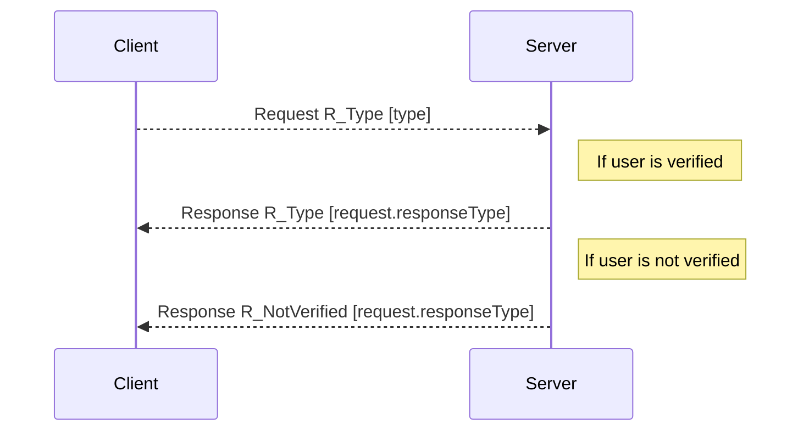
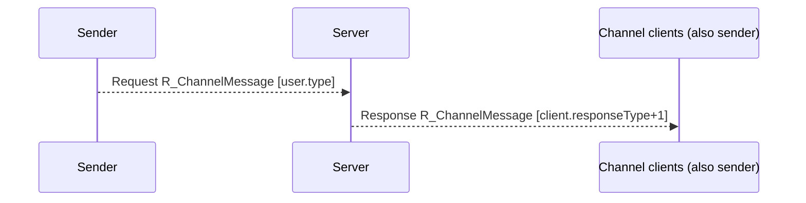
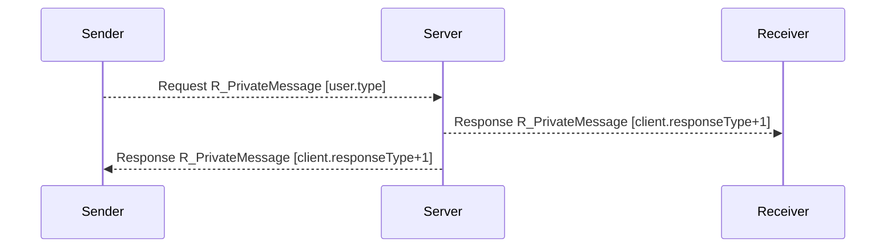
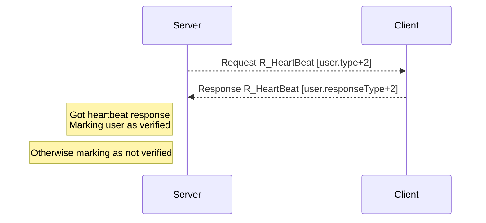

# Linux Chat App

Linux chat app that uses only System V inter-process communication facilities (IPCS) to communicate written in C.

Project created for "System and Concurrent Programming" course at Poznan University of Technology.

## Protocol

Communication protocol used to exchange data between client and server was based on HTTP.

C structs used during communication:

```c
typedef  struct {
 long type;
 char body[REQUEST_BODY_MAX_SIZE];
 unsigned long bodyLength;
 StatusCode status;
 RType rtype;
 long responseType;
 int channelId;
} Request;

typedef Request Response;
```

Purpose of struct's properties:

* **type** - communication type also treated as userId
* **body** - communicate body
* **bodyLength** - length of communicate body (string length)
* **status** - response status
* **rtype** - response/request type defining what server is asked for (request) or what contains the response
* **responseType** - communication type used to send response
* **channelId** - id of the channel that user is connected to

StatusCode and RType are enums defined as follows:

```c
typedef enum {
 StatusG,
 StatusOK,
 StatusServerFull,
 StatusValidationError,
 StatusInternalError,
 StatusNotVerified
} StatusCode;

typedef enum {
 R_Generic,
 R_Init,
 R_RegisterUser,
 R_UnregisterUser,
 R_ListChannel,
 R_JoinChannel,
 R_LeaveChannel,
 R_CreateChannel,
 R_ListUsersOnChannel,
 R_ListUsers,
 R_ChannelMessage,
 R_PrivateMessage,
 R_HeatBeat
} RType;
```

### Communication diagram

In square brackets on diagrams contains the communication type id.

#### General requests

On client request server answers with response of the same `R_Type`. Only when the user is not verified, server returns `R_NotVerified` and refuses answering to the client.



#### Channel & private messages

Client listens for all type of messages on different process, what makes whole message communication asynchronus.

Communication type is incremented by 1 to distinct the communication from general requests and heartbeat.

##### Channel messages



##### Private message



#### Heartbeat mechanism

Every 5 seconds (+- current response time) server sends `R_HeartBeat` request to the client. If the client sends response in 10ms, the user is marked as verified. Otherwise is marked as not verified and next request will be rejected with `R_NotVerified` response.

Communication type is incremented by 2 to distinct the communication from general requests and messages.



## Compilation

```bash
gcc -Wall shared/* resources/client/* client.c -o client.out
gcc -Wall shared/* resources/server/* server.c -o server.out
```

## How to run

Executable files have help, which can be runned by `./<executable-file> --help`.

### Server

When you run server file, you'll be asked about ipc id to create queue.
You can also provide the queue id by `-i <id>` or `--id <id>` parameter.

### Client

When you run client file, you'll be asked about ipc id to connect to (it has to exist and has to be used by the server).
You can also provide that by `-s <id>` or `--server <id>` parameter.

After getting correct server id, you'll be asked about username. It has to be unique.
You can also provide that by `-u <username>` or `--username <username>`.
